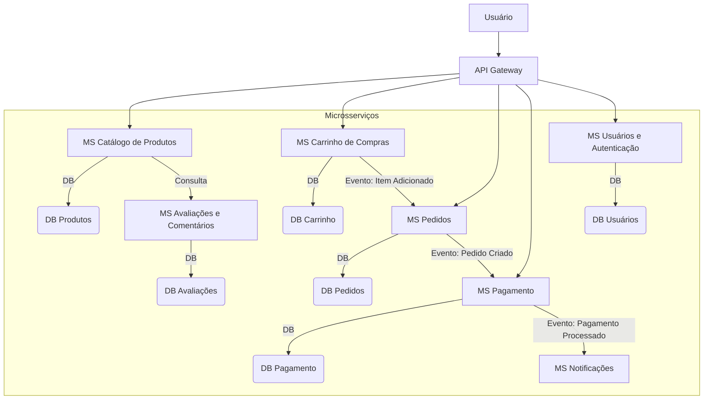

## Arquitetura de Microsserviços

```mermaid
graph TD
    subgraph Microsserviços
        MS1[MS Catálogo de Produtos] -- DB --> DB1(DB Produtos)
        MS2[MS Carrinho de Compras] -- DB --> DB2(DB Carrinho)
        MS3[MS Pedidos] -- DB --> DB3(DB Pedidos)
        MS4[MS Pagamento] -- DB --> DB4(DB Pagamento)
        MS5[MS Usuários e Autenticação] -- DB --> DB5(DB Usuários)
        MS6[MS Notificações]
        MS7[MS Avaliações e Comentários] -- DB --> DB7(DB Avaliações)
    end
    User[Usuário] --> API_GW[API Gateway]
    API_GW --> MS1
    API_GW --> MS2
    API_GW --> MS3
    API_GW --> MS4
    API_GW --> MS5
    MS2 -- Evento: Item Adicionado --> MS3
    MS3 -- Evento: Pedido Criado --> MS4
    MS4 -- Evento: Pagamento Processado --> MS6
    MS1 -- Consulta --> MS7
```

