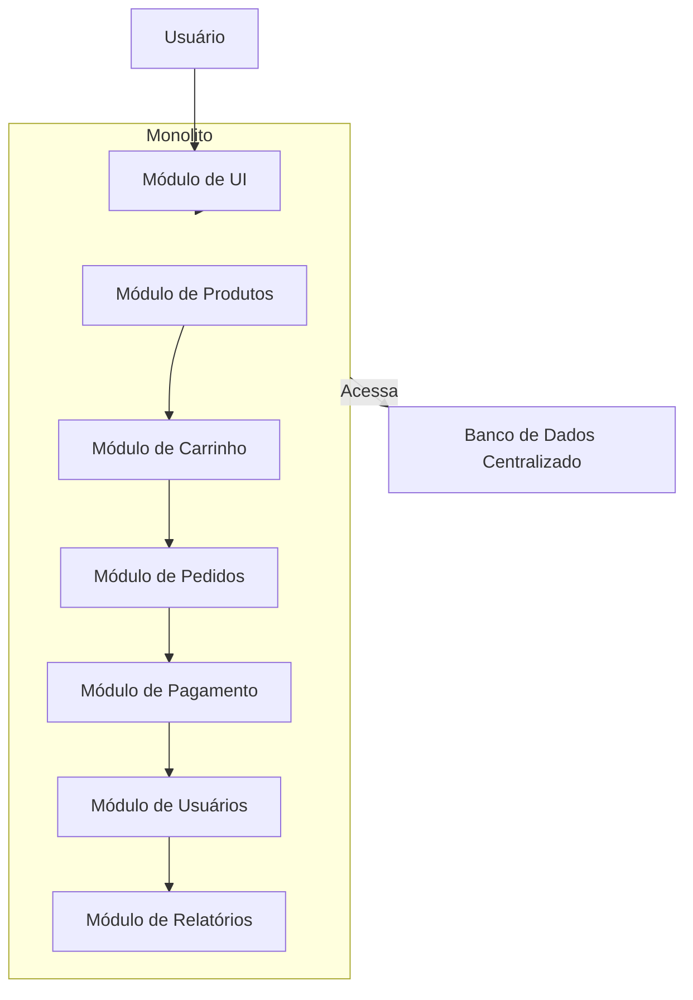

## Arquitetura Monolítica

```mermaid
graph TD
    User[Usuário] --> UI[Módulo de UI]
    UI --> Monolito
    subgraph Monolito
        A[Módulo de Produtos]
        B[Módulo de Carrinho]
        C[Módulo de Pedidos]
        D[Módulo de Pagamento]
        E[Módulo de Usuários]
        F[Módulo de Relatórios]
        UI
        A --> B
        B --> C
        C --> D
        D --> E
        E --> F
    end
    Monolito -- Acessa --> H[Banco de Dados Centralizado]
```
