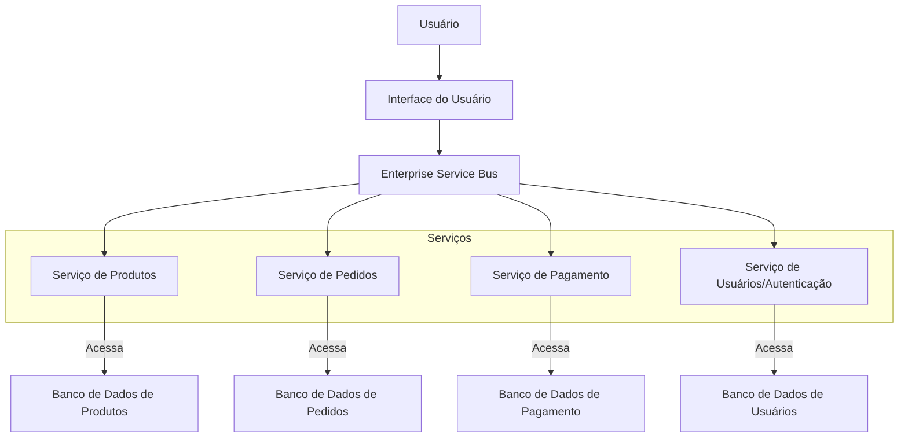

## Arquitetura Orientada a Serviços (SOA)

```mermaid
graph TD
    User[Usuário] --> UI[Interface do Usuário]
    UI --> ESB[Enterprise Service Bus]
    subgraph Serviços
        A[Serviço de Produtos]
        B[Serviço de Pedidos]
        C[Serviço de Pagamento]
        D[Serviço de Usuários/Autenticação]
    end
    ESB --> A
    ESB --> B
    ESB --> C
    ESB --> D
    A -- Acessa --> DB_Prod[Banco de Dados de Produtos]
    B -- Acessa --> DB_Ped[Banco de Dados de Pedidos]
    C -- Acessa --> DB_Pag[Banco de Dados de Pagamento]
    D -- Acessa --> DB_User[Banco de Dados de Usuários]
```